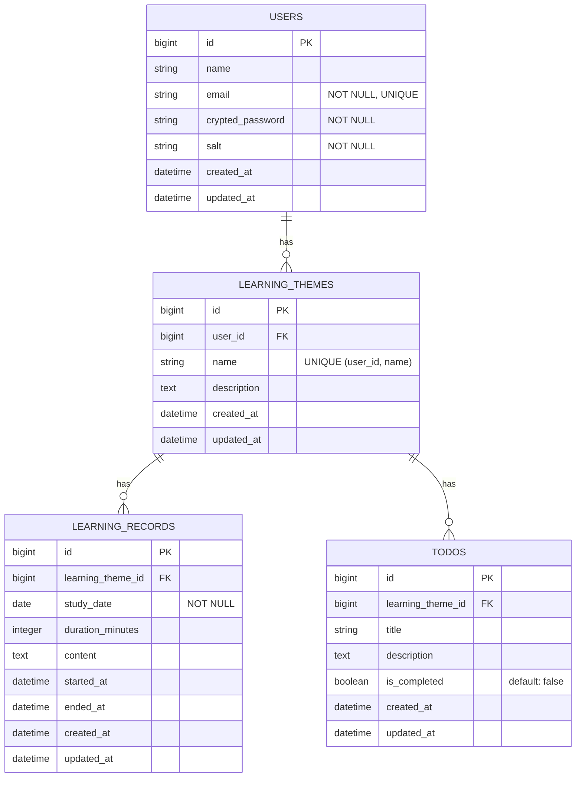

# ER Diagram

## 1️⃣ エンティティ一覧

- users
- learning_themes
- learning_records
- todos

---

## 2️⃣ エンティティ責務整理

### users

- アプリ利用者
- 認証情報を持つ

### learning_themes

- ユーザーが設定する学習テーマ
- 1ユーザーに属する

### learning_records

- 日々の学習記録
- 1テーマに属する

### todos

- テーマ単位のタスク
- 1テーマに属する

---

## 3️⃣ リレーション整理

- `user` は 0以上の `learning_themes`を持つ
- `learning_theme` は 0以上の `learning_records` を持つ
- `learning_theme` は 0以上の `todos` を持つ
- 多対多関係は存在しない

---

## 4️⃣ 設計判断メモ

- `learning_records`に `user_id` は持たせない
  - `learning_theme` を経由して `user` に帰属するため
  - 冗長性 および 整合性リスク を回避する

  👉 *ユーザーが `learning_theme` を削除した場合、そこに紐づいた一連の長期記録も消えるが、その判断をユーザーに委ねることが本アプリの設計思想の根幹である「内省」を促すと考えた*

---

## 5️⃣ 制約設計

### **NOT NULL** 制約

- ユーザー登録について
  - `users.email` は NOT NULL

- 学習内容の記録について
  - `learning_themes.user_id`は NOT NULL
  - `learning_records.learning_theme_id` は NOT NULL
  - `todos.learning_theme_id` は NOT NULL
  - `learning_records.content` は NOT NULL

- 記録オプションについて
  - `learning_records.duration_minutes` は NULL 許可
  - `learning_records.started_at` は NULL 許可
  - `learning_records.ended_at` は NULL 許可

  設計方針:

  - `learning_records.duration_minutes` については本アプリの主たる機能に関するが、ユーザー判断で使わないことを敢えて許容したい
  - 「手入力」での記録を許容するため、`started_at` と `ended_at` は NULL を許可するが、「ストップウォッチ」使用時は両カラムセットで保存する
  - `duration_minutes` は集計効率のため保存する
  - 各カラムの整合性はアプリケーションレイヤーで担保する

### **UNIQUE** 制約

- `users.email` は UNIQUE
- `learning_themes.name` は *`user_id` + `name`* において UNIQUE

### **外部キー** 制約

- `learning_themes.user_id` → `users.id`
- `learning_records.learning_theme_id` → `learning_themes.id`
- `todos.learning_theme_id`→ `learning_themes.id`

  削除ポリシー:

  - `learning_theme` 削除時に `learning_records` / `todos` は削除される

    - Rails: `dependent: :destroy`
    - DB: `ON DELETE CASCADE`

### 依存関係

- 重複データについて

  ```bash
  #データ構造
    users
      └ learning_themes
          ├ learning_records
          └ todos
  ```

  👉 *不必要な冗長性は排除できている*

- 推移的依存について

  ```bash
  # テーブルの依存関係
    `learning_record` → `learning_theme` → `user`
  ```

  👉 *`learning_records` に `user_id` を持たせていないため、第3正規形を満たしている (あるキー属性が別の非キー属性に依存してない)*

---

## ER図


