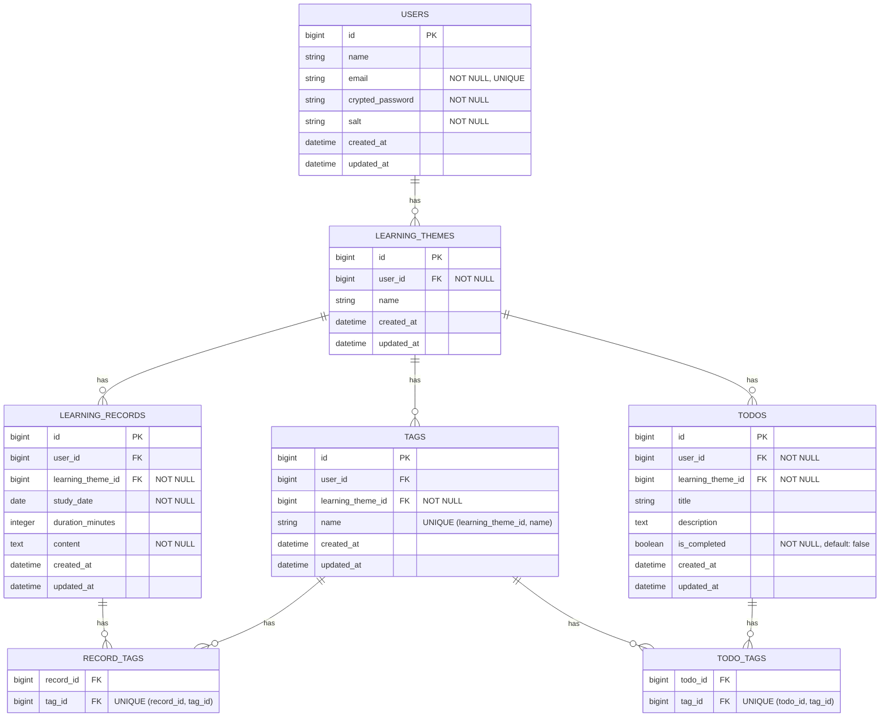

# ER Diagram

## 1️⃣ エンティティ一覧

- users
- learning_themes
- learning_records
- tags
- todos

---

## 2️⃣ エンティティ責務整理

### users

- アプリ利用者
- 認証情報を持つ

### learning_themes

- ユーザーが設定する学習テーマ
- `learning_records` / `tags` / `todos` の親となる単位

### learning_records

- 日々の学習記録

### tags

- ユーザーが設定するタグ

### todos

- テーマ単位のタスク

---

## 3️⃣ リレーション整理

- `user` は 1以上の `learning_themes`を持つ
- `learning_theme` は 0以上の `learning_records` を持つ
- `learning_theme` は 0以上の `tags` を持つ
- `learning_theme` は 0以上の `todos` を持つ
- `learning_records` と `tags` は多対多関係
- `todos` と `tags` も多対多関係
- 多対多関係は、それぞれ `record_tags`, `todo_tags` で管理する

---

## 4️⃣ 設計判断メモ

- TOP ページから「今日の記録」ヘダイレクトに飛ぶくらいのシンプルな構成が望ましい。

- アプリによって記録するデータは「今日の記録」を主軸に構成し、ユーザーの記録スタイルの多様を担保するために `Tags` を自由度高く使えるように実装したい。

---

## 5️⃣ 制約設計

### **NOT NULL** 制約

- ユーザー登録について
  - `users.email` は NOT NULL

- 学習テーマについて
  - `learning_themes.user` は NOT NULL
  - `learning_themes.name` は NULL 許可

  設計方針：

  - テーマ名はユーザーの任意入力とし、記録スタイルの自由を担保する
  - フォームにはプレースホルダーで入力を促すが、必須とはしない
  - テーマの存在有無は `learning_theme.any?` で条件分岐して対応する

- 学習内容の記録について
  - `learning_records.user_id`は NOT NULL
  - `learning_records.content` は NOT NULL

- 記録オプションについて
  - `learning_records.duration_minutes` は NULL 許可

  設計方針:

  - `learning_records.duration_minutes` については本アプリの主たる機能に関するが、ユーザー判断で使わないことを敢えて許容したい
  - 「手入力」での記録を許容するため `duration_minutes` は NULL を許可するが、「ストップウォッチ」使用時は `duration_minutes` によって集計する
  - 各カラムの整合性はアプリケーションレイヤーで担保する

### **UNIQUE** 制約

- `users.email` は UNIQUE
- `tags.name` は、 `learning_theme_id` + `name` で UNIQUE
- `record_tags` は、`(record_id, tag_id)` で UNIQUE
- `todo_tags` は `(todo_id, tag_id)` で UNIQUE

### 正規化について

本設計は第3正規形（3NF）を満たすことを意識している。

- 第1正規形
  繰り返し属性を排除するため、`learning_records` と `tags` の多対多関係を
  中間テーブル `record_tags` に分離した。

- 第2正規形
  主キーまたは複合キーに対して、非キー属性が完全関数従属するよう設計している。
  中間テーブル（`record_tags` / `todo_tags` ）は非キー属性を持たないため問題は発生しない。

- 第3正規形
  非キー属性が他の非キー属性に依存する推移的依存を排除している。
  例えば、`tags` や `users` の情報を `learning_records` に重複保持していない。

---

## ER図

```mermaid
erDiagram

    USERS {
        bigint id PK
        string name
        string email "NOT NULL, UNIQUE"
        string crypted_password "NOT NULL"
        string salt "NOT NULL"
        datetime created_at
        datetime updated_at
    }

    LEARNING_THEMES {
        bigint id PK
        bigint user_id FK "NOT NULL"
        string name
        datetime created_at
        datetime updated_at
    }

    LEARNING_RECORDS {
        bigint id PK
        bigint user_id FK
        bigint learning_theme_id FK "NOT NULL"
        date study_date "NOT NULL"
        integer duration_minutes
        text content "NOT NULL"
        datetime created_at
        datetime updated_at
    }

    TAGS {
        bigint id PK
        bigint user_id FK
        bigint learning_theme_id FK "NOT NULL"
        string name "UNIQUE (learning_theme_id, name)"
        datetime created_at
        datetime updated_at
    }

    TODOS {
        bigint id PK
        bigint user_id FK "NOT NULL"
        bigint learning_theme_id FK "NOT NULL"
        string title
        text description
        boolean is_completed "NOT NULL, default: false"
        datetime created_at
        datetime updated_at
    }

    RECORD_TAGS {
        bigint record_id FK
        bigint tag_id FK "UNIQUE (record_id, tag_id)"
    }

    TODO_TAGS {
      bigint todo_id FK
      bigint tag_id FK "UNIQUE (todo_id, tag_id)"
    }

    USERS ||--o{ LEARNING_THEMES : has
    LEARNING_THEMES ||--o{ LEARNING_RECORDS : has
    LEARNING_THEMES ||--o{ TAGS : has
    LEARNING_THEMES ||--o{ TODOS : has

    LEARNING_RECORDS ||--o{ RECORD_TAGS : has
    TAGS ||--o{ RECORD_TAGS : has

    TODOS ||--o{ TODO_TAGS : has
    TAGS ||--o{ TODO_TAGS : has
```
